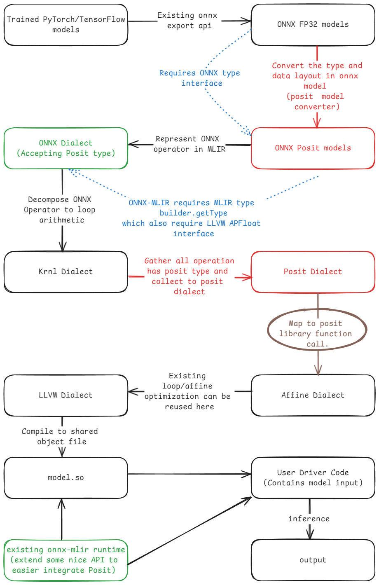

Author: 洪祐鈞

# Architecture:
- We are currently on the circle brown part.
- Black means existing solution.
- Green means needs to extend.
- Red means haven't touched
- Blue means kind of verify it works.

# Summary:

- Based on the MNIST model, we would like try to see what operation we need to convert.
	- Now we are converting `memref`, `affine` operations' types.
- In this note, we also see how a simple quantization get lowered with newly proposed quant dialect lowering
- In this note, we also see how does affine dialect works
- Our whole project can be reduced 2 parts, currently:
	- Modify type: 
		- We are forcing all the `f32` converted to the target integer type.
	- Modify value: 
		- The scalar and tensor value raw data can be modified in MLIR.
- Current Status:
	- Still implementing all the operation that touch `f32` one by one in MNIST model.
	- Trying to get MNIST model running with posit operation
		- For verifying swapping all `arith` operation to equivalent function call works!
	- Then we can move all the interface out.
- The ultimate goal:
	- Type:
		- ONNX model with posit type
		- While MLIR has to support posit.
	- Value:
		- The raw data is convert in custom python posit converter instead of MLIR.
# How to quantize?

- For quantize abstraction, normally framework implement themselves
	- 1 month ago, LLVM pull request has **quant lowering** support of converting to equivalent ops.
	- The RFC is here: [Link](https://discourse.llvm.org/t/rfc-improvements-in-the-quant-dialect/79942)
- Main concept of LLVM quant dialect: Types, Operations, Passes
	- Types:
		- `!quant.uniform<u16<0:1023>:f32, 1.23:512>`
			- This is not an operation, THIS IS A TYPE
			- Uniform **Per Layer** quantization from `f32` to `u16`, the `u16` value is bound `[0, 1023]`, which only 10 bit are used
			- scale is `1.23`, zero point is `512`.
		- `tensor<2x3x4x!quant.uniform<i8:f32:1, {3.0:1, 4.0:2, 5.0:3}>>`
			- Uniform **Per Channel** quantization from f32 to i8
			- The channel is on index 1 dimension (0-indexed).
				- `tensor<2x"3"x4>`
			- scale is `(3, 4, 5)` and zero point is `(1, 2, 3)`
	- Operations:
		- `qcast`: Convert a floating-point value to a quantized type
			- `%result = quant.qcast %input : tensor<?xf32> to tensor<?x!quant.uniform<i8:f32, 2.0>>`
		- `dcast`: Convert a quantized value back floating-point value.
			- `%result = quant.dcast %input : tensor<?x!quant.uniform<i8:f32, 2.0>> to tensor<?xf32>`
		- `scast`: Convert between a quantized type and `signless` integer storage type. 
			- This does not used to manipulate value!
			- `%result = quant.scast %input : tensor<?x!quant.uniform<i8:f32, 2.0>> to tensor<?xi8>`
	- Passes:
		- `--lower-quant-ops`:
			- Lowering `qcast`, `dcast` to core dialects operations.
			- With `scast` at the end for type casting.
		- `--strip-func-quant-types`
			- Replace `!quant.uniform` types in function input/output with its storage type.
- `--lower-quant-ops` example:
	- Input:
	```cpp
	!qalias = !quant.uniform<i8<-8:7>:f32, 2.0:10>
	func.func @f(%arg0: tensor<3x5xf32>) -> tensor<3x5x!qalias> {
		%0 = quant.qcast %arg0 : tensor<3x5xf32> to tensor<3x5x!qalias>
		return %0 : tensor<3x5x!qalias>
	}
	```
	- Output:
	```cpp
	func.func @f(%arg0: tensor<3x5xf32>) -> tensor<3x5x!qalias> {
		// Create scale tensor.
		%cst = arith.constant 2.000000e+00 : f32
		%splat = tensor.splat %cst : tensor<3x5xf32>
		
		// Divide by scale
		%0 = arith.divf %arg0, %splat : tensor<3x5xf32>
		
		// Create zero point float tensor
		%c10_i8 = arith.constant 10 : i8
		%splat_0 = tensor.splat %c10_i8 : tensor<3x5xi8>
		%1 = arith.sitofp %splat_0 : tensor<3x5xi8> to tensor<3x5xf32>
		
		// Add zero point
		%2 = arith.addf %0, %1 : tensor<3x5xf32>
		
		// Convert stored value to integer
		%3 = arith.fptosi %2 : tensor<3x5xf32> to tensor<3x5xi8>
		
		// Clamp stored value
		%c-8_i8 = arith.constant -8 : i8
		%c7_i8 = arith.constant 7 : i8
		%splat_1 = tensor.splat %c-8_i8 : tensor<3x5xi8>
		%splat_2 = tensor.splat %c7_i8 : tensor<3x5xi8>
		%4 = arith.maxsi %3, %splat_1 : tensor<3x5xi8>
		%5 = arith.minsi %4, %splat_2 : tensor<3x5xi8>
		
		// Cast stored value to quantized type
		%6 = quant.scast %5 : tensor<3x5xi8> to tensor<3x5x!qalias>
		return %6 : tensor<3x5x!qalias>
		}
	```
- `--strip-func-quant-types`:
	- Input:
```cpp
!qalias = !quant.uniform<i8:f32, 1.0>

func.func @predict(%arg0: tensor<3x!qalias>, %arg1: tensor<3x!qalias>) 
	-> tensor<3x!qalias> {
	
	%sum = "ml.add"(%arg0, %arg1) : (tensor<3x!qalias>, tensor<3x!qalias>) 
		-> tensor<3x!qalias>
		
	return %sum : tensor<3x!qalias>
}
```
	- output
```cpp
!qalias = !quant.uniform<i8:f32, 1.0>

func.func @predict(%arg0_stripped: tensor<3xi8>, %arg1_stripped: tensor<3xi8>) 
	-> tensor<3xi8> {

	// Conversion of function arguments
	%arg0 = "quant.scast"(%arg0_stripped): (tensor<3xi8>) 
		-> tensor<3x!qalias>
	%arg1 = "quant.scast"(%arg1_stripped): (tensor<3xi8>) 
		-> tensor<3x!qalias>

	// Function body
	%sum = "ml.add"(%arg0, %arg1) : (tensor<3x!qalias>, tensor<3x!qalias>) 
		-> tensor<3x!qalias>

	// Conversion of return values
	%sum_stripped = "quant.scast"(%sum): (tensor<3x!qalias>) 
		-> tensor<3xi8>
	  
	  return %sum_stripped : tensor<3xi8>
}
```
- How to find the project using LLVM quant dialect?
	- Search for `CHECK-NEXT` and `quant.qcast` match the same time on GitHub
	- Mostly, it is just a abstraction of the quantization, but the conversion is somewhere else.
	- This is very inspirational actually.
- Example project using LLVM quant dialect: [DeepRec](https://github.com/DeepRec-AI/DeepRec/tree/9e30ab604aa316359f249bc061b5fe87a5773604)
	- [Testcase source code link](https://github.com/DeepRec-AI/DeepRec/blob/9e30ab604aa316359f249bc061b5fe87a5773604/tensorflow/compiler/mlir/lite/quantization/xla/tests/weight-only.mlir#L6)
	- Input:
		```cpp
		func @add(%arg0: tensor<2x2xf32>) -> tensor<2x2xf32> {
			%b = constant dense<1.0> : tensor<2xf32>
			
			%add = "xla_hlo.add"(%arg0, %b) {broadcast_dimensions = dense<1> :
				tensor<1xi64>} : (tensor<2x2xf32>, tensor<2xf32>) -> 
					tensor<2x2xf32>
					
			return %add: tensor<2x2xf32>
		}
		```
	- Output:
		```cpp
		func @add(%arg0: tensor<2x2xf32>) -> tensor<2x2xf32> {
			%b = constant dense<1.000000e+00> : tensor<2xf32>
			
			%q = "quant.qcast"(%b) : (tensor<2xf32>) -> 
				tensor<2x!quant.uniform<u8:f32, 0.0039215686274509803>>
				
			%dq = "quant.dcast"(%q)
				: (tensor<2x!quant.uniform<u8:f32, 0.0039215686274509803>>)
					-> tensor<2xf32>
					
			%add = "xla_hlo.add"(%arg0, %dq)
				{broadcast_dimensions = dense<1> : tensor<1xi64>} 
					: (tensor<2x2xf32>, tensor<2xf32>) -> tensor<2x2xf32>
		}
		```
- Explanation:
	- `tf-opt -xla-hlo-propagate-quant`
	- Why `tensor<2x2xf32>`, `tensor<2xf32>` can add up?
		- [broadcast](https://openxla.org/xla/broadcasting)allows it.
		- `[[1, 2, 3], [4, 5, 6]] + [1, 2, 3] = [[2, 4, 6], [5, 7, 9]]`
	- Lower the `xla_hlo` dialect to LLVM quant dialect, use add for example.
	- Insert `qcast` and `dcast` to function as a quantize abstraction.
- If the newly added quant lowering support chip in, it can expand `qcast` and `dcast`, further lower to `quant.scast` for more handling.
- Other Reference
	- https://discourse.llvm.org/t/rfc-removing-the-ops-from-the-quant-dialect/3643
		- 
	- https://github.com/tensorflow/tensorflow/blob/master/tensorflow/compiler/mlir/lite/tests/quantize.mlir
		- Take quantize conv2D for example, it convert the weight and the input to `tfl.pseudo_const` with `!quant.uniform<u8:f32, [scale]>` element type.
	- https://github.com/tensorflow/tensorflow/blob/2ace75af7df543cd7227d5bd2c7bb14ad9cc2630/tensorflow/compiler/mlir/quantization/tensorflow/tests/convert_fake_quant_to_qdq.mlir#L4
		- `Tensorflow` actually migrate the `quant.dcast` to `quantfork.dcast`

## Lowering `Affine` and `Memref` operation
- Review:
	- We can lower the following:
		- `arith.add`: map the add to posit function call/symbol
		- `arith.const`: Lowering the scalar data to `signless raw data`
		- `Krnl.global`: Where the giant model weight is located.
			- Modify the value attribute tensor data and type
			- Modify the return type.
- This week:
	- Lowering `memref.alloc` and `memref.alloca`type.
- Trying to lower other `memref` ops like `memref.store/load`
- Affine dialect is still not handled but it should relatively simple.

No issue:
`./onnx-mlir-opt --convert-arith-to-posit-func='n-bits=8 es-val=0' /home/sylvex/onnx-mlir/src/Conversion/ArithToPositFunc/test_krnl.mlir`

TBD:
`./onnx-mlir-opt --convert-arith-to-posit-func='n-bits=8 es-val=0' /home/sylvex/onnx-mlir/src/Conversion/ArithToPositFunc/test.mlir`

Try to get work:
`./onnx-mlir --EmitMLIR /home/sylvex/mnist_export/mnist_model.onnx -o ./log.txt`

- entry: `func.func @main_graph(%arg0: memref<1x1x28x28xf32>`-> `(memref<1x10xf32> {onnx.name = "19"})`
	- `attributes {llvm.emit_c_interface}`

- Affine Dialect Polyhedral Structure:
	- `()` means dimension, `[]` means symbol
		- [Constraint](https://mlir.llvm.org/docs/Dialects/Affine/#restrictions-on-dimensions-and-symbols)
		- Always index type.
	- `affine.apply` must be 1D
	- First example:
		- `#map9 = affine_map<(d0, d1) -> (d0 * 64 + d1)>`
			- Map 2D to 1D, output 1D `d0 * 64 + d1`
		- `%8 = affine.apply #map9(%arg2, %arg3)`
			- `%8 = %arg2 * 64 + %arg3`
	- Second example:
		- `#map5 = affine_map<(d0)[s0] -> (d0 + s0)>`
			- Map 1D to 1D. output 1D `d0 + s0`
		- `%14 = affine.apply #map5(%arg6)[%arg2]`
			- `%14 = arg6 + arg2`
	- Third example:
		- `#map8 = affine_map<(d0)[s0, s1, s2, s3, s4] -> (s0 - ((s2 ceildiv s4) * s4 - s2), -(d0 * s3 - s2) + s0, d0 * s3 + (s1 - 1) * s4 - s2 - ((s2 ceildiv s4) * s4 - s2) + 1, d0 * s3 + (s1 - 1) * s4 - s2 - (d0 * s3 - s2) + 1)>`
			- map 1D to 4D, now we annotate the 4D result as `[r0, r1, r2, r3]`
		- `affine.for %arg5 = 0 to min #map8(%arg3)[%c28, %c2, %c0, %c2, %c1]`
			- After Mapping, `%min_res = min(r0, r1, r2, r3)` and the `%arg5` is from 0 to `%min_res`
- Affine for loop construct:
	- `iter_args(%arg7 = %cst_0)` must have correspond yield.
		- Example:
			```cpp
			%cst_0 = arith.constant 0.000000e+00 : f32
			%9 = affine.for %arg6 = 0 to 30 iter_args(%arg7 = %cst_0) -> (f32) 
			{
				...
				affine.yield %12 : f32
			}
			```
		- Initialize `%arg7` to `%cst_0` which is `0`
		- `%arg7 = %12` at the end of the loop
		- After `30` iteration, return the `%12` result.

- `"krnl.entry_point"() {func = @main_graph, numInputs = 1 : i32, numOutputs = 1 : i32, signature = "[    { \22type\22 : \22f32\22 , \22dims\22 : [1 , 1 , 28 , 28] , \22name\22 : \22x.1\22 }\0A\0A]\00@[   { \22type\22 : \22f32\22 , \22dims\22 : [1 , 10] , \22name\22 : \2219\22 }\0A\0A]\00"} : () -> ()`
- `%alloc = memref.alloc() {alignment = 16 : i64} : memref<1x32x28x28xf32>`
	- `getType()`
- `%alloca_6 = memref.alloca() : memref<f32>`
	- `getType()`
- `%13 = memref.load %alloc_4[%arg1, %arg2, %11, %12] : memref<1x64x14x14xf32>`
	- `getType()`
- no memref.store??
- `%reinterpret_cast = memref.reinterpret_cast %alloc_5 to offset: [0], sizes: [1, 3136], strides: [3136, 1] : memref<1x64x7x7xf32> to memref<1x3136xf32>`
	- to??
- `%9 = affine.for %arg6 = 0 to 1 iter_args(%arg7 = %cst_0) -> (f32)`
	- `getType()`??
- `affine.yield %20 : f32`
	- `getType()`
- `%17 = affine.load %arg0[%arg1, %14, %15, %16] : memref<1x1x28x28xf32>`
	- `getType()`
- `affine.store %11, %alloc[%arg1, %8, %arg4, %arg5] : memref<1x32x28x28xf32>`
	- `getType()`
- `%9 = arith.cmpf oge, %8, %cst_0 : f32`
	- oge??
	- ordered v.s unordered
		- https://stackoverflow.com/questions/8627331/what-does-ordered-unordered-comparison-mean
