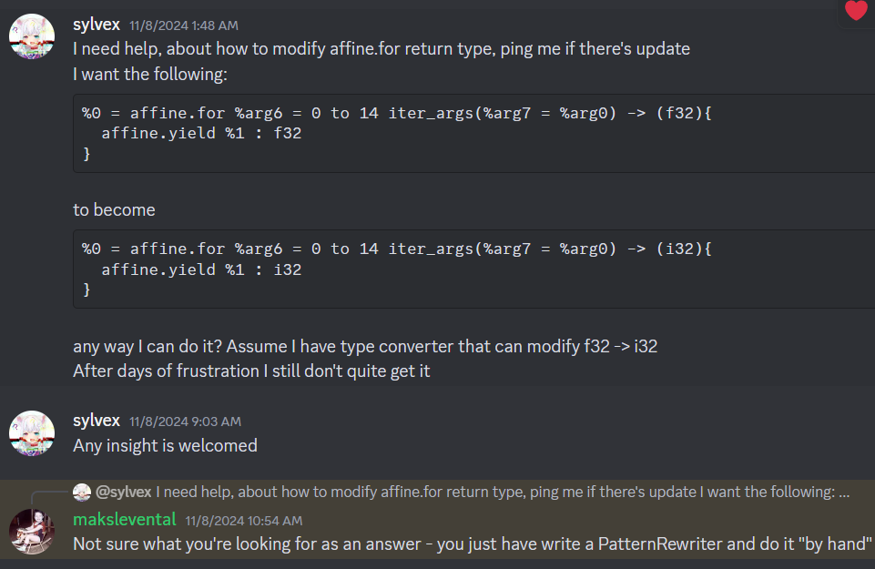

# Task

- Writing a pass that convert all `f32` data type to say, `uint8`
	- Probably should convert operation 1 by 1.
- Turn off the constant propagation in posit.
- `@run_main_graph`
	- `KrnlEntryPointOpLowering`
- Universal Wrapper
	- `NaR` handling.
# Summary:

1. Failed to lower `AffineForOp`
# What does `forOp` consist of?

```cpp
Value initConstant = builder.create<arith::ConstantFloatOp>(
      builder.getUnknownLoc(), 
      APFloat(3.2f), builder.getF32Type());
auto forOp = builder.create<affine::AffineForOp>
  (
    builder.getUnknownLoc(), // location
	0,                       // lower bound
	64,                      // upper bound
	1,                       // step
	initConstant,            // IterArgs
	bodyBuilder              // bodyBuilder function
  );
```

Equivalent C++:

```cpp
for(int i = 0, float res = 3.2f; i < 64; i += 1)
{
	res = bodyBuilder(i, res);
}
return res;
```
- The `AffineForOp` can return values
- The most important is `IterArgs` and `bodyBuilder`
	- `IterArgs`:  `ValueRage`
		- Loop carried variables.
		- The number of `IterArgs` is equivalent to the number of results.
	- `BodyBuilder`: `func(builder, loc, inductionValue, iterArgs)`
		- `BodyBuilder` is a callback function for building operations in `forOp` body
		- `inductionValue`: the i in for loop: `for(int i=0; i<64; i+=i)`, type: `Value`
		- `iterArgs`: As aforementioned.

# `bodyBuilder` Callback

- The following is trying to insert operations through bodybuilder.
- `BodyBuilder`: `func(builder, loc, inductionValue, iterArgs)`

```cpp
// %0 = affine.for %arg1 = 0 to 64 
	// iter_args(%arg2 = %cst_0) -> (f32) {
auto bodyBuilder = [&](OpBuilder &nestedBuilder, 
					   Location loc, Value iv, 
					   ValueRange iterArgs) {
					 
// %arg3 = affine.load %arg0[%arg1] : memref<64xf32>
auto loadOp = nestedBuilder.create<affine::AffineLoadOp>(
	loc, memrefArg, ValueRange{iv});

// %arg3 = affine.load %arg0[%arg1] : memref<64xf32>
Value addResult =
	nestedBuilder.create<arith::AddFOp>(loc, 
		loadOp.getResult(), iterArgs[0]
	);

// affine.yield %arg4 : f32
nestedBuilder.create<affine::AffineYieldOp>(loc, addResult);
};
```
# Don't know how to lower??

- Refer to existing implementation:
	- Lowering `affine::ForOp` to `scf::ForOp`
		```cpp
		auto scfForOp = rewriter.create<scf::ForOp>
		(loc, lowerBound, upperBound, step, op.getInits());
		rewriter.eraseBlock(scfForOp.getBody());
		rewriter.inlineRegionBefore
			(op.getRegion(), scfForOp.getRegion(),
				scfForOp.getRegion().end());
		rewriter.replaceOp(op, scfForOp.getResults());
		```
- Create `scf::ForOp` and replace `affine::ForOp`
	1. Create `scf::ForOp` with original `IterArgs`
	2. Clear `scf::ForOp` block (operation inside `scf::ForOp`)
	3. Insert `affine::ForOp` to `scf::ForOp` body
		```cpp
		ScfFor
		{
			AffineFor{
				// Operations
				yield f32
			}
		}
		```
	4. Replace `affine::ForOp` result used with `Scf::ForOp`
- Basically now we apply the same trick, create new type converted `forOp` and same goes later...

# Oh no it Failed

- errors:
```cpp
./test_affine.mlir:34:8: error: 'affine.for' op 0-th init and 0-th region iter_arg have different type: 'i16' != 'f32'                                                %0 = affine.for %arg6 = 0 to 64 iter_args(%arg7 = %cst_0) -> (f32) {
```

- `newForOp` Log:
```cpp
newForOp: %2 = "affine.for"(%0) <{lowerBoundMap = affine_map<() -> (0)>, operandSegmentSizes = array<i32: 0, 0, 1>, step = 1 : index, upperBoundMap = affine_map<() -> (64)>}> ({
^bb0(%arg3: index, %arg4: i16):
}) : (i16) -> i16 
```

- The error seemed to come from the `iterArgs` type does not handled properly
- However logged the newly create operation does show the `iterArgs` has converted type.

Error dump(generic form):

```cpp
// -----// IR Dump After ConvertArithToPositFuncPass Failed (convert-arith-to-posit-func) //----- //

#map = affine_map<(d0) -> (d0)>
#map1 = affine_map<() -> (0)>
#map2 = affine_map<() -> (64)>
"builtin.module"() ({
  "func.func"() <{function_type = (memref<64xi16>) -> i16, 
    sym_name = "test_affineForLoop"}> ({
  ^bb0(%arg0: memref<64xi16>):
    %0 = "arith.constant"() <{value = 0 : i16}> : () -> i16
    
    %1 = "affine.for"(%0) <{lowerBoundMap = #map1, 
      operandSegmentSizes = array<i32: 0, 0, 1>, 
      step = 1 : index, upperBoundMap = #map2}> 
      ({
	    ^bb0(%arg1: index, %arg2: f32):
	    
	    %2 = "affine.load"(%arg0, %arg1) <{map = #map}> 
		    : (memref<64xi16>, index) -> i16
		    
	    "affine.yield"(%2) : (i16) -> ()
	    
	  }) : (i16) -> i16
	  
    "func.return"(%1) : (i16) -> ()
  }) : () -> ()
}) : () -> ()
```

- Issue:
	- Created: `^bb0(%arg3: index, %arg4: i16):`
	- After Conversion: `^bb0(%arg1: index, %arg2: f32):`
	- From the after-failed log, we see that block argument does not handled properly.
	- I guess the old region override the new converted block argument??

- Ask Discord:

- Basically it doesn't help. Might go to MLIR forum and ask.

# AffineForOp

op.getBody()->getArgument()
`./onnx-mlir-opt --convert-arith-to-posit-func='n-bits=16 es-val=3' /home/sylvex/onnx-mlir/src/Conversion/ArithToPositFunc/test_affine.mlir --mlir-print-op-generic`

```cpp
  "func.func"() <{function_type = (i16) -> (), sym_name = "test_affineForLoop"}> ({
  ^bb0(%arg0: i16):
    %0 = "memref.alloca"() <{operandSegmentSizes = array<i32: 0, 0>}> : () -> memref<1x64x14x14xi16>
    "affine.for"() <{lowerBoundMap = #map1, operandSegmentSizes = array<i32: 0, 0, 0>, step = 1 : index, upperBoundMap = #map4}> ({
    ^bb0(%arg1: index):
      "affine.for"() <{lowerBoundMap = #map1, operandSegmentSizes = array<i32: 0, 0, 0>, step = 1 : index, upperBoundMap = #map3}> ({
      ^bb0(%arg2: index):
        "affine.for"() <{lowerBoundMap = #map1, operandSegmentSizes = array<i32: 0, 0, 0>, step = 1 : index, upperBoundMap = #map2}> ({
        ^bb0(%arg3: index):
          "affine.for"() <{lowerBoundMap = #map1, operandSegmentSizes = array<i32: 0, 0, 0>, step = 1 : index, upperBoundMap = #map2}> ({
          ^bb0(%arg4: index):
            "affine.store"(%arg0, %0, %arg2, %arg3, %arg4, %arg1) <{map = #map}> : (i16, memref<1x64x14x14xi16>, index, index, index, index) -> ()
            "affine.yield"() : () -> ()
          }) : () -> ()
          "affine.yield"() : () -> ()
        }) : () -> ()
        "affine.yield"() : () -> ()
      }) : () -> ()
      "affine.yield"() : () -> ()
    }) : () -> ()
    "func.return"() : () -> ()
  }) : () -> ()
}) : () -> ()


```

Lowering Affine For
```cpp
class AffineForLowering : public OpRewritePattern<AffineForOp> {
public:
  using OpRewritePattern<AffineForOp>::OpRewritePattern;

  LogicalResult matchAndRewrite(AffineForOp op,
                                PatternRewriter &rewriter) const override {
    Location loc = op.getLoc();
    Value lowerBound = lowerAffineLowerBound(op, rewriter);
    Value upperBound = lowerAffineUpperBound(op, rewriter);
    Value step =
        rewriter.create<arith::ConstantIndexOp>(loc, op.getStepAsInt());
    auto scfForOp = rewriter.create<scf::ForOp>(loc, lowerBound, upperBound,
                                                step, op.getInits());
    rewriter.eraseBlock(scfForOp.getBody());
    rewriter.inlineRegionBefore(op.getRegion(), scfForOp.getRegion(),
                                scfForOp.getRegion().end());
    rewriter.replaceOp(op, scfForOp.getResults());
    return success();
  }
};
```

Building AffineFor
```cpp
FailureOr<LoopLikeOpInterface> AffineForOp::replaceWithAdditionalYields(
    RewriterBase &rewriter, ValueRange newInitOperands,
    bool replaceInitOperandUsesInLoop,
    const NewYieldValuesFn &newYieldValuesFn) {
  // Create a new loop before the existing one, with the extra operands.
  OpBuilder::InsertionGuard g(rewriter);
  rewriter.setInsertionPoint(getOperation());
  auto inits = llvm::to_vector(getInits());
  inits.append(newInitOperands.begin(), newInitOperands.end());
  AffineForOp newLoop = rewriter.create<AffineForOp>(
      getLoc(), getLowerBoundOperands(), getLowerBoundMap(),
      getUpperBoundOperands(), getUpperBoundMap(), getStepAsInt(), inits);
```

what is induction variables?

```cpp
/// Helper to replace uses of loop carried values (iter_args) and loop
/// yield values while promoting single iteration affine.for ops.
static void replaceIterArgsAndYieldResults(AffineForOp forOp) {
  // Replace uses of iter arguments with iter operands (initial values).
  auto iterOperands = forOp.getInits();
  auto iterArgs = forOp.getRegionIterArgs();
  for (auto e : llvm::zip(iterOperands, iterArgs))
    std::get<1>(e).replaceAllUsesWith(std::get<0>(e));

  // Replace uses of loop results with the values yielded by the loop.
  auto outerResults = forOp.getResults();
  auto innerResults = forOp.getBody()->getTerminator()->getOperands();
  for (auto e : llvm::zip(outerResults, innerResults))
    std::get<0>(e).replaceAllUsesWith(std::get<1>(e));
}
```

`rewriter.convertRegionTypes()`

# Modify the operation type

```
// Method 1: Using Operation::setResultTypes
SmallVector<Type, 2> newTypes = {builder.getI64Type(), builder.getF32Type()};
// Note: This is only safe if the new types are compatible with all uses
op->setResultTypes(newTypes);

// Method 2: Using TypeRange constructor
ArrayRef<Type> newTypeArray = ArrayRef<Type>(newTypes);
TypeRange newTypeRange(newTypeArray);
op->setResultTypes(newTypeRange);
```

# Affine

See how krnl.iterate works to get affine.
locate at test/mlir/krnl

Try to get work:
`./onnx-mlir --EmitMLIR /home/sylvex/mnist_export/mnist_model.onnx -o ./log.txt`

# Materialization

The code are all look like the same.
```cpp
addSourceMaterialization([&](OpBuilder &builder, Type resultType,
						   ValueRange inputs,
						   Location loc) -> std::optional<Value> {
if (inputs.size() != 1)
  return std::nullopt;

return builder.create<UnrealizedConversionCastOp>(loc, resultType, inputs)
	.getResult(0);
});

addTargetMaterialization([&](OpBuilder &builder, Type resultType,
						   ValueRange inputs,
						   Location loc) -> std::optional<Value> {
if (inputs.size() != 1)
  return std::nullopt;

return builder.create<UnrealizedConversionCastOp>(loc, resultType, inputs)
	.getResult(0);
});
```