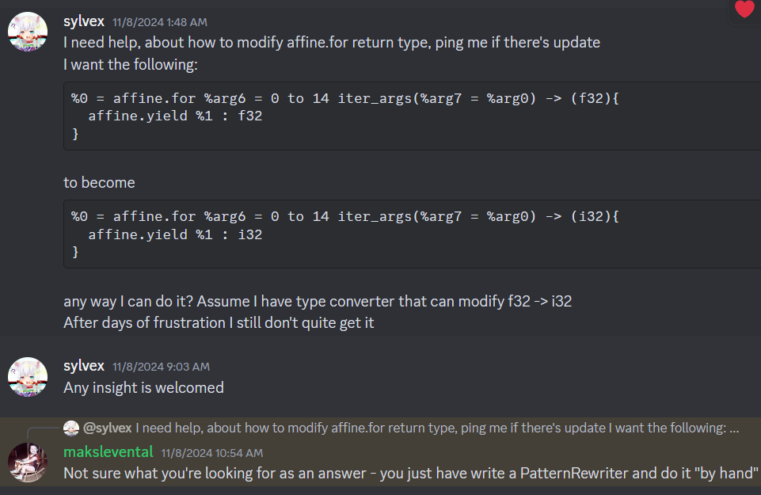

# 11-12 Personal Research
## Presenter: Yu Chun Hung
## Advisor: Peng-Sheng Cheng

---

# Summary:

1. Failed to lower `AffineForOp`

---

# What does `forOp` consist of?

- For a creation of: 
  - `%cst_0 = arith.constant 3.2f : f32`
  - `%0 = affine.for %arg1 = 0 to 64 iter_args(%arg2 = %cst_0) -> (f32)`
- Equivalent C++:
```cpp
float res = 3.2f
for(int i = 0; i < 64; i += 1)
{
    res = bodyBuilder(i, res);
}
return res;
```

---

# What does `forOp` consist of?

- For a creation of: 
  - `%cst_0 = arith.constant 3.2f : f32`
  - `%0 = affine.for %arg1 = 0 to 64 iter_args(%arg2 = %cst_0) -> (f32)`
```cpp
Value initConstant = builder.create<arith::ConstantFloatOp>(
      builder.getUnknownLoc(), 
      APFloat(3.2f), builder.getF32Type());
auto forOp = builder.create<affine::AffineForOp>
  (
    builder.getUnknownLoc(), // location
    0,                       // lower bound
    64,                      // upper bound
    1,                       // step
    initConstant,            // IterArgs
    bodyBuilder              // bodyBuilder function
  );
```

---

# What does `forOp` consist of?

- The `AffineForOp` can return values
- The most important is `IterArgs` and `bodyBuilder`
	- `IterArgs`:  `ValueRage`
		- Loop carried variables.
		- The number of `IterArgs` is equivalent to the number of results.
	- `BodyBuilder`: `func(builder, loc, inductionValue, iterArgs)`
		- `BodyBuilder` is a callback function for building operations in `forOp` body
		- `inductionValue`: the i in for loop: `for(int i=0; i<64; i+=i)`, type: `Value`
		- `iterArgs`: As aforementioned.

---

# `bodyBuilder` Callback

- The following is trying to insert operations through bodybuilder.
- `BodyBuilder`: `func(builder, loc, inductionValue, iterArgs)`

```cpp
// %0 = affine.for %arg1 = 0 to 64 iter_args(%arg2 = %cst_0) -> (f32) {
auto bodyBuilder = [&](OpBuilder &nestedBuilder, Location loc, 
                       Value iv, ValueRange iterArgs) {
					 
// %arg3 = affine.load %arg0[%arg1] : memref<64xf32>
auto loadOp = nestedBuilder.create<affine::AffineLoadOp>(
	loc, memrefArg, ValueRange{iv});

// %arg3 = affine.load %arg0[%arg1] : memref<64xf32>
Value addResult =
	nestedBuilder.create<arith::AddFOp>(loc, loadOp.getResult(), iterArgs[0]
	);

// affine.yield %arg4 : f32
nestedBuilder.create<affine::AffineYieldOp>(loc, addResult);
};
```

---

# Don't know how to lower??

- Refer to existing implementation:
	- Lowering `affine::ForOp` to `scf::ForOp`
		```cpp
		auto scfForOp = rewriter.create<scf::ForOp>
		(loc, lowerBound, upperBound, step, op.getInits());
		rewriter.eraseBlock(scfForOp.getBody());
		rewriter.inlineRegionBefore
			(op.getRegion(), scfForOp.getRegion(),
				scfForOp.getRegion().end());
		rewriter.replaceOp(op, scfForOp.getResults());
		```

---

# Don't know how to lower??

- Create `scf::ForOp` and replace `affine::ForOp`
	1. Create `scf::ForOp` with original `IterArgs`
	2. Clear `scf::ForOp` block (operation inside `scf::ForOp`)
	3. Insert `affine::ForOp` to `scf::ForOp` body
		```cpp
		ScfFor
		{
            AffineFor{
                // Operations
                yield f32
            }
		}
		```
	4. Replace `affine::ForOp` result used with `Scf::ForOp`
- Basically now we apply the same trick, create new type converted `forOp` and same goes later...

---

# Oh no it Failed

- errors:
```cpp
./test_affine.mlir:34:8: error: 'affine.for' op 0-th init and 0-th region iter_arg 
have different type: 'i16' != 'f32'
%0 = affine.for %arg6 = 0 to 64 iter_args(%arg7 = %cst_0) -> (f32) 
```

- `newForOp` Log:
```cpp
newForOp: %2 = "affine.for"(%0) <{lowerBoundMap = affine_map<() -> (0)>, 
operandSegmentSizes = array<i32: 0, 0, 1>, step = 1 : index, 
upperBoundMap = affine_map<() -> (64)>}> ({
^bb0(%arg3: index, %arg4: i16):
}) : (i16) -> i16 
```
- The error seemed to come from the `iterArgs` type does not handled properly
- However logged the newly create operation does show the `iterArgs` has converted type.

---

# Oh no it Failed

- Error dump(generic form):

```cpp
// -----// IR Dump After ConvertArithToPositFuncPass Failed (convert-arith-to-posit-func) //----- //

#map = affine_map<(d0) -> (d0)>
#map1 = affine_map<() -> (0)>
#map2 = affine_map<() -> (64)>
"builtin.module"() ({
  "func.func"() <{function_type = (memref<64xi16>) -> i16, 
    sym_name = "test_affineForLoop"}> ({
  ^bb0(%arg0: memref<64xi16>):
    %0 = "arith.constant"() <{value = 0 : i16}> : () -> i16
    
    %1 = "affine.for"(%0) <{lowerBoundMap = #map1, 
      operandSegmentSizes = array<i32: 0, 0, 1>, 
      step = 1 : index, upperBoundMap = #map2}> 
      ({
	    ^bb0(%arg1: index, %arg2: f32):
	    
	    %2 = "affine.load"(%arg0, %arg1) <{map = #map}> 
		    : (memref<64xi16>, index) -> i16
		    
	    "affine.yield"(%2) : (i16) -> ()
	    
	  }) : (i16) -> i16
	  
    "func.return"(%1) : (i16) -> ()
  }) : () -> ()
}) : () -> ()
```

---

# Oh no it Failed

- Issue:
	- Created: `^bb0(%arg3: index, %arg4: i16):`
	- After Conversion: `^bb0(%arg1: index, %arg2: f32):`
	- From the after-failed log, we see that block argument does not handled properly.
	- I guess the old region override the new converted block argument??

---

# Getting Help

- Ask Discord:

  - Basically it doesn't help. Might go to MLIR forum and ask.