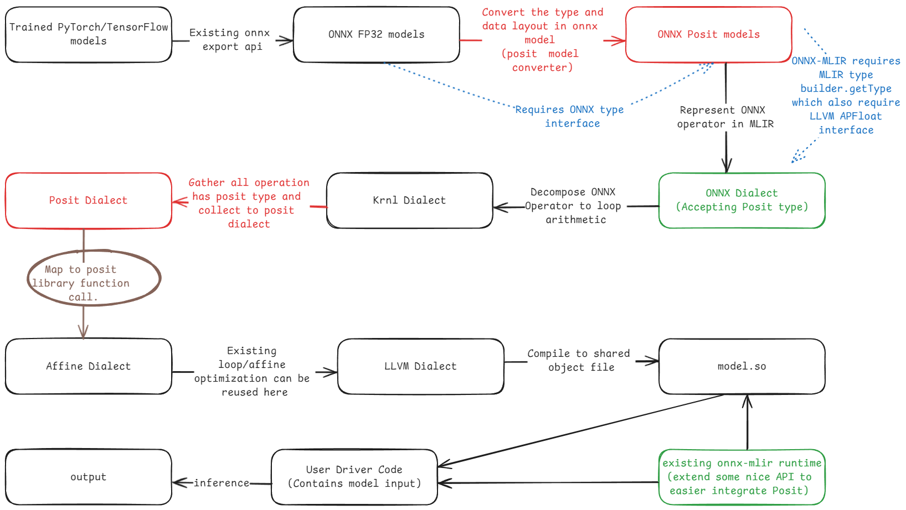

# 11-5 Personal Research
## Presenter: Robin Hung
## Advisor: Peng-Sheng Cheng

---
# Architecture:



---

# Summary:

- This week:
	- Based on MNIST model, we currently lower all the operation that touch `f32` to target integer width.
		- Lowered all `memref` operation
		- `affine` `forOp` and related is not lowered

---

# Operation Handled

- This week, based on MNIST model:
	- `memref` dialect
		- `memref`: `loadOp`, `reinterpreteCastOp`
	- `affine`: `loadOp`, `storeOp`

---

# Operation Handled

- Input:

```cpp
func.func @test_affineLoadStoreMixed
  (%arg0: index, %arg1: index, %arg2: index, %arg3: index) 
  -> memref<1x288xf32>
{
  %alloc = memref.alloca() : memref<32x1x3x3xf32>
  
  %0 = affine.load %alloc[%arg0, %arg1, %arg2, %arg3] : 
    memref<32x1x3x3xf32>
    
  %1 = arith.addf %0, %0 : f32
  
  affine.store %1, %alloc[%arg0, %arg1, %arg2, %arg3] : 
    memref<32x1x3x3xf32>
    
  %reinterpret_cast = memref.reinterpret_cast 
    %alloc to offset: [0], sizes: [1, 288], strides: [288, 1] 
    : memref<32x1x3x3xf32> to memref<1x288xf32>
    
  return %reinterpret_cast : memref<1x288xf32>
}
```

---

# Operation Handled

- Output: (target: posit<16,3>)

```cpp
module {
  func.func private @posit16es3_add(i16, i16) 
    -> i16 attributes {llvm.readnone}
    
  func.func @test_affineLoadStoreMixed
    (%arg0: index, %arg1: index, %arg2: index, %arg3: index)
      -> memref<1x288xi16> {
      
    %alloca = memref.alloca() : memref<32x1x3x3xi16>
    
    %0 = affine.load %alloca[%arg0, %arg1, %arg2, %arg3] : memref<32x1x3x3xi16>
    
    %1 = call @posit16es3_add(%0, %0) : (i16, i16) -> i16
	  
    affine.store %1, %alloca[%arg0, %arg1, %arg2, %arg3] : 
      memref<32x1x3x3xi16>
    
    %reinterpret_cast = memref.reinterpret_cast 
      %alloca to offset: [0], sizes: [1, 288], strides: [288, 1] 
        : memref<32x1x3x3xi16> to memref<1x288xi16>
        
    return %reinterpret_cast : memref<1x288xi16>
  }
}
```
---

# Operation Handled

Summary:
- Combined with multiple dialect operation lowering, currently has no issue.
- The above testcase contains
	- `arith`:  `add`
	- `affine`: `load`/`store`
	- `memref`: `alloca`, `reinterpret_cast`
	- `return`: memref tensor

---

# Operation Not Handled

Based on MNIST model:
- affine: `forOp`, `yieldOp`
- templated basic `arith` operation
- Entry point related function.

---

# Should we do Quantize in compiler stack?

[more quantize feature in quant dialect RFC](https://discourse.llvm.org/t/rfc-add-suport-for-quantilequantizedtype-in-quant-dialect/80346)

```
In newer work, I wouldn’t implement this concept at all in MLIR 
or the compiler proper but in the frontend. 
There are several examples of convergent evolution on this kind of thing, 
which show some of the different/related approaches:

The thing that all of these have in common 
is that they deal with encoding/layout/quantization 
far up the stack with runtime vs compile time parameterization. 
And they break the problem down at the top vs 
trying to preserve strong typing of a specific quantization algorithm 
deep in the compiler type hierarchy.
```

- [Pytorch ao 1](https://github.com/pytorch/ao)
- [Sharktank direct quantization 7](https://github.com/nod-ai/sharktank/blob/main/docs/quantization.md) (my group develops this for certain of our optimized models)
- [Modular quant encoding 6](https://docs.modular.com/max/api/maojo/graph/quantization/)

---

# Should we do Quantize in compiler stack?

- What we can summarize from last week 'quantization' is that:
	- The quantization abstraction is done with compile time type.
- Summary of people start the quant dialect:
	- For the projected listed above, we can see similar evolution that implement quantization at the frontend instead of compiler stack.
	- It's more favorable parametrize at runtime but compile time.
- Is it worth it to preserve the quantization abstraction?

---

# How Do I normally modify the Operation

`replaceOpWithNewOp<NewOpTy>(oldOp) `
`= create<NewOpTy> + replaceOp(oldOp, newOp)`
- create a new operation and replace the old operation 

`replaceOp(oldOp, newOp)` 
`= replaceAllOpUsesWith(oldOp, newOp->getResults()) + erase(oldOp)`
- Replace all result uses, the result type should match.
- The old op is then erased.
  -  `erase(Op)`: Using post order traversal to remove enclosing op one by one.

---

# How Do I normally modify the Operation

`replaceAllOpUsesWith` = `notifyOperationReplaced` + `replaceAllUsesWith`

- `replaceAllUsesWith(ValueRange from, ValueRange to)` :
	- Redirects any references from the old value to the new one
	- Iterate the from `results` and to `results` by same index 
	- Set the correspond operand with new value.
        ```cpp
        void replaceAllUsesWith(Value from, Value to) {
          for (OpOperand &operand : 
            llvm::make_early_inc_range(from.getUses())) {
            Operation *op = operand.getOwner();
            modifyOpInPlace(op, [&]() { operand.set(to); });
          }
        }
        ```
- `notifyOperationReplaced`: logger for the correspond rewriter.

---

# How Do I normally modify the Operation

- `make_early_inc_range`: 
	- The iterator increments immediately after dereferencing, allowing node deletion or insertion without disrupting the process, as long as the next iterator remains valid.
- `modifyOpInPlace`: notify start and end of operation modification with callback.

---

# Future Works

- More operation forOp
- Various MLIR stuff tries to figure out