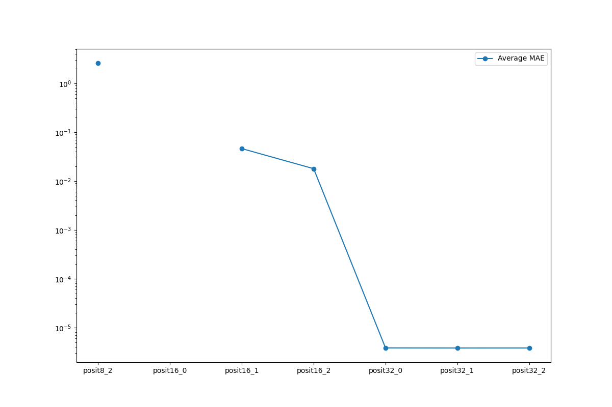
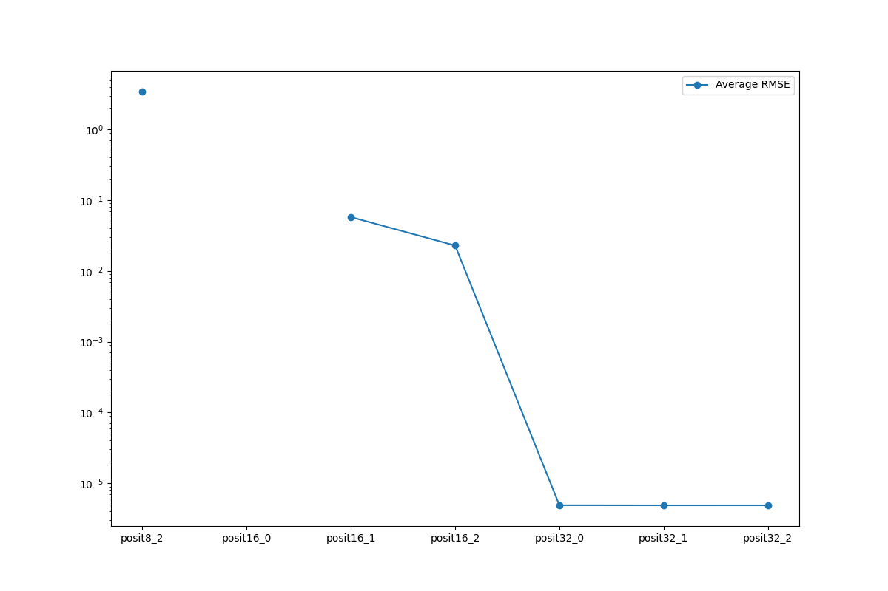
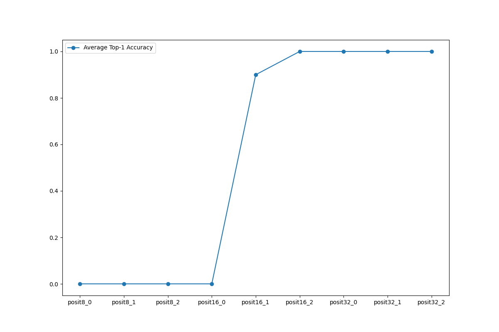
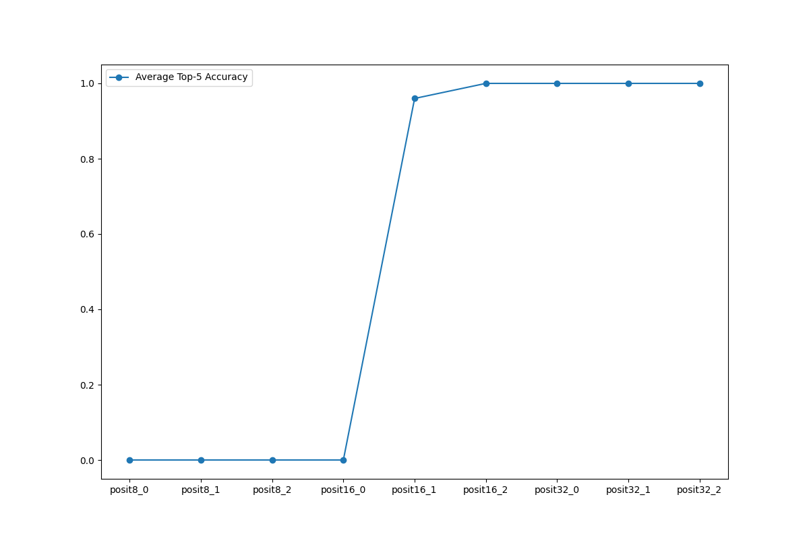

# 3-13 Personal Research
## Presenter: Yu-Chun Hung
## Advisor: Peng-Sheng Cheng

---

# Summary

- Bug Fix: Input does not load properly.
- Feature added: 
	- JSON file storage
	- Graph
- Experiment on `mobilenetv2`, sample = 10, es = 0, 1, 2
	- posit8 and posit(16, 0) failed
	- posit32 numerical result is almost the same as fp32
	- posit16 other than es=0, has acceptable output
---

# Average mean average error

---

# Average root mean square error 

---

# top1 accuracy 

---

# top5 accuracy

---

# Future Works

- MNIST model
	- Operation is more simple may show more of posit.
- Object Detection model
  - Some model cannot compile

---

# Happy Birthday
