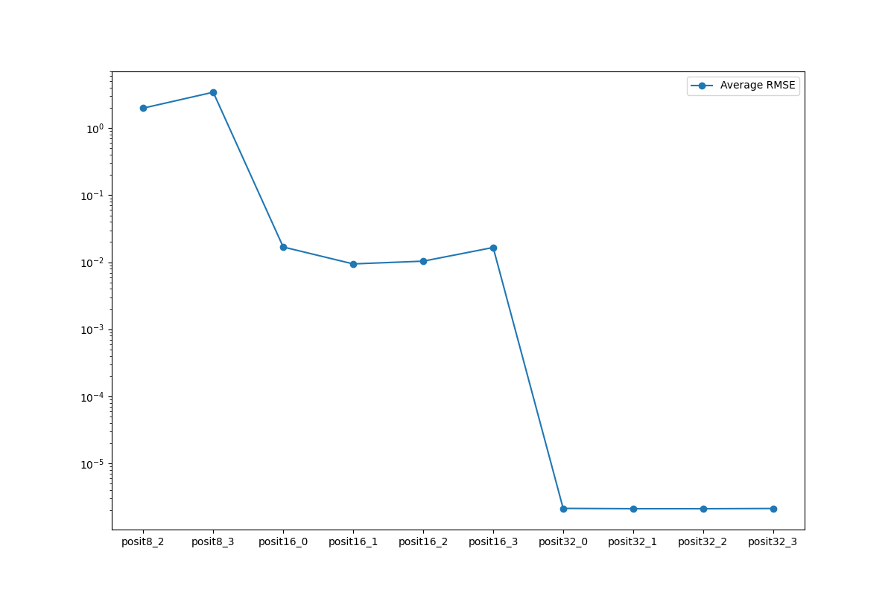
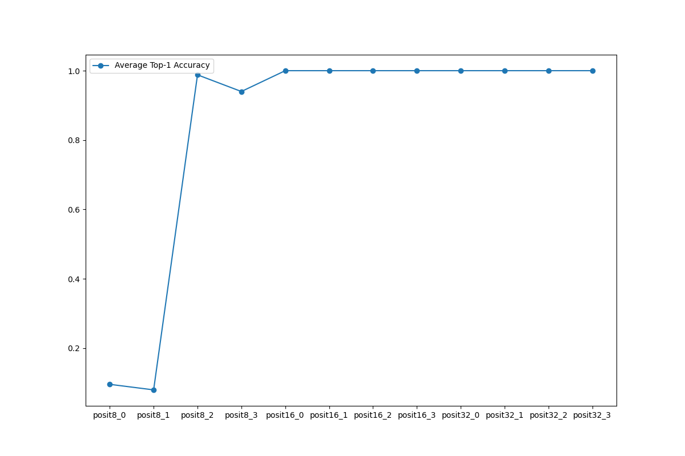
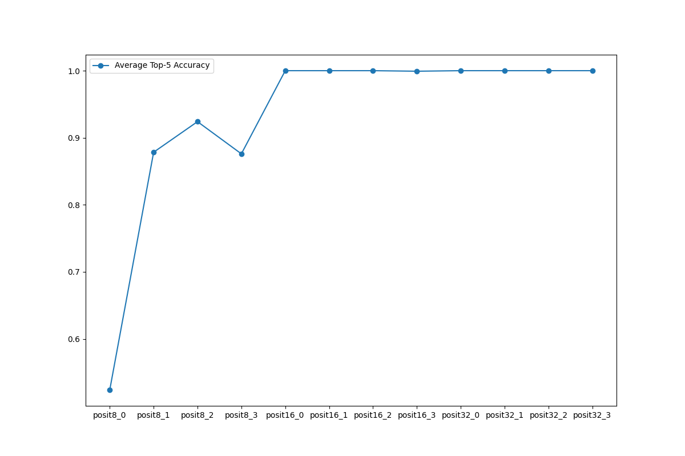
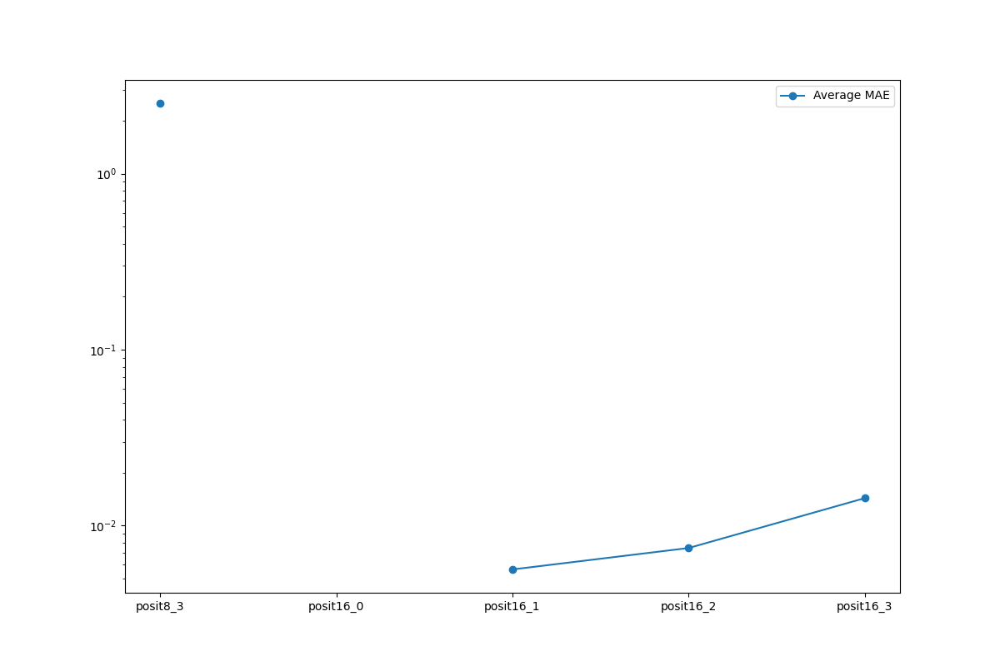
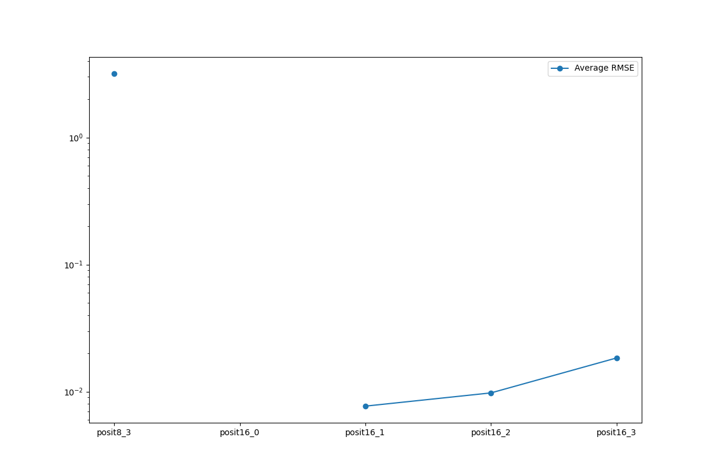
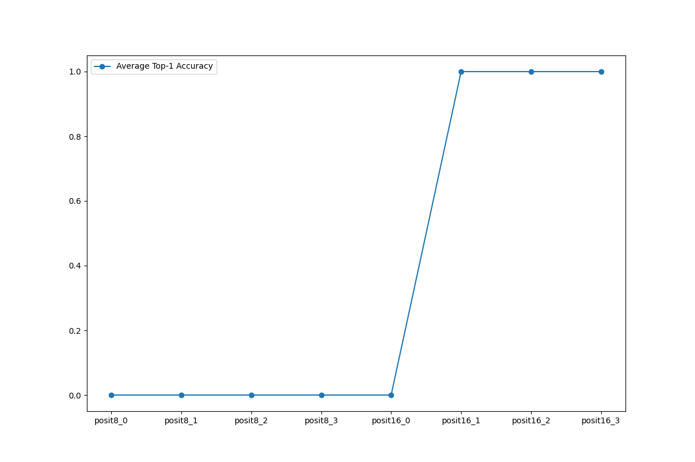
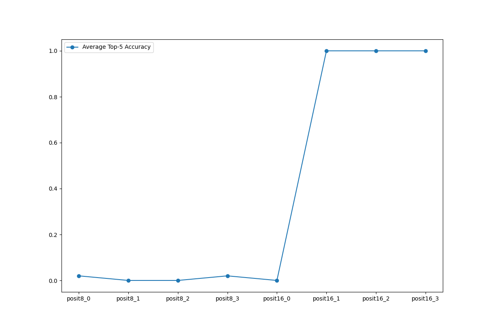
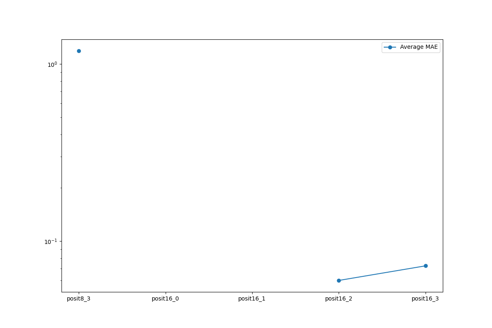
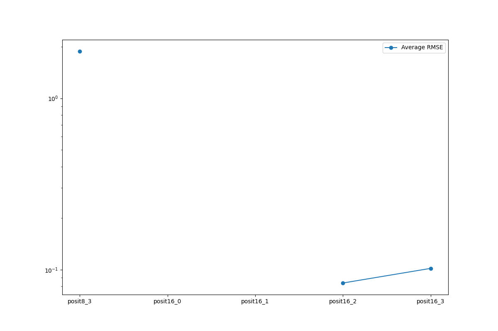

# Summary

- mnist, pascal-voc dataset parsing.
- Experiment on `mnist`, `resnet-18`: (classification)
	- For `mnist`: (Hand writing classification)
		- (8, 0), (8,1) does not work
		- (8, 2) has best accuracy in 8-bit
	- For `resnet-18`: (ImageNet)
		- 8-bit does not work, (16, 0) also not working.
		- Other than es=0, all 16-bit hit 100% accuracy.
		- Does not run 32-bit, since single testcase require 4 hours.
- Experiment on `tinyyolov2`: (not done)
	- Getting bounding box from model output is kind of hard.
	- Huge chance that only (16, 2), (16, 3) works, below 32 bits
	- Does not run 32-bit

---
# mnist Average MAE (sample = 250)

---
# mnist Average RMSE (sample = 250)

---
# mnist Average Top-1 Accuracy (sample = 250)

---
# mnist Average Top-5 Accuracy (sample = 250)

---

# resnet-18 Average MAE (sample = 10)

---
# resnet-18 Average RMSE (sample = 10)

---
# resnet-18 Average Top-1 Accuracy (sample = 10)

---
# resnet-18 Average Top-5 Accuracy (sample = 10)

---

# tinyyolov2 Average MAE (sample = 5)

---
# tinyyolov2 Average MAE (sample = 5)

---

# About tinyyolov2

- All data set so far is parsed with hand-crafted code
	- Our `numpy` package need to stuck at some version and it's too old for modern framework like torch.
- pascal-voc image is variable sized, it need to be resized to 1x3x416x416 tensor, while keeping same aspect ratio.
	- Bounding box need to scale accordingly, we need the original

---

