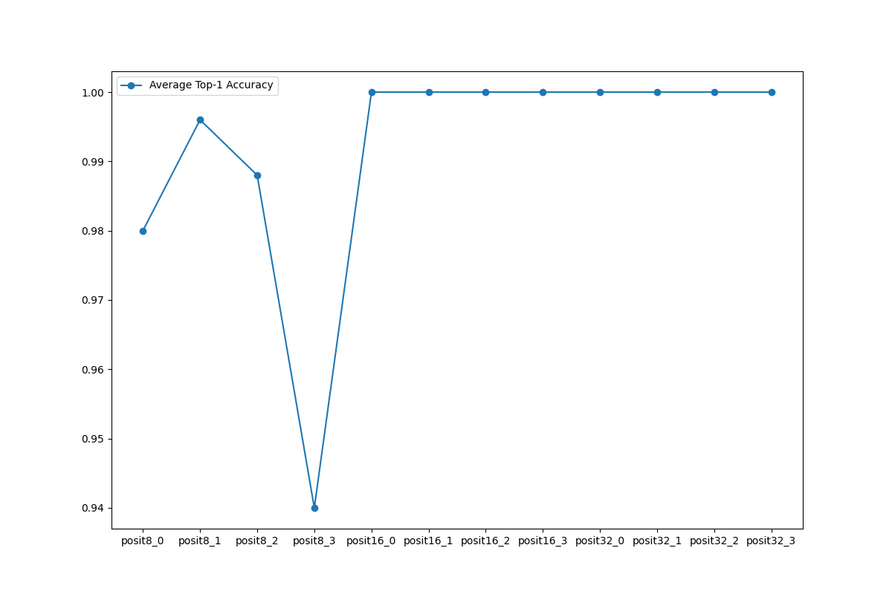
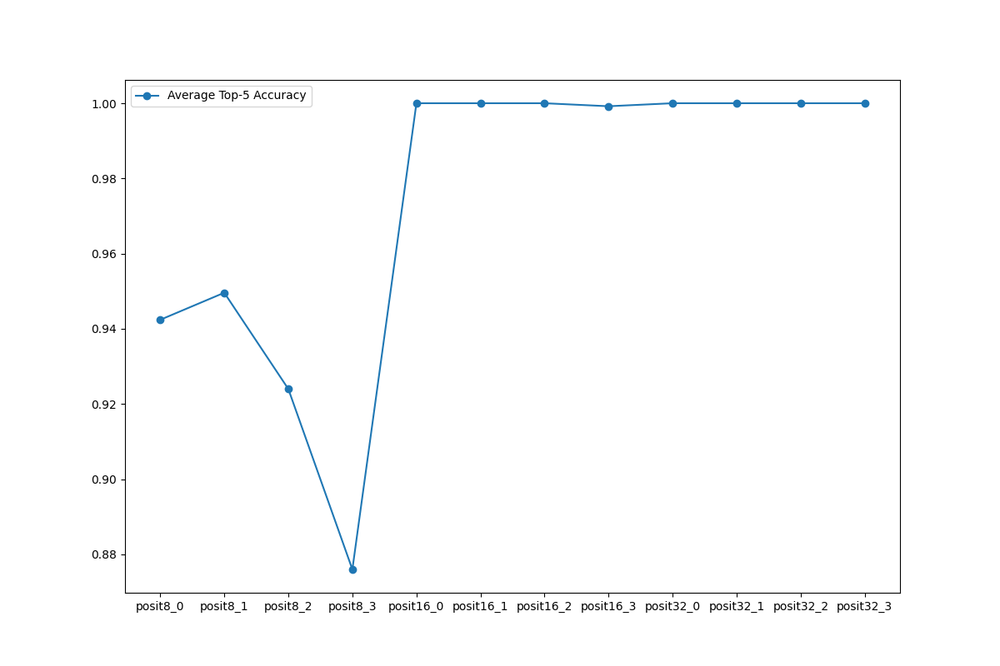
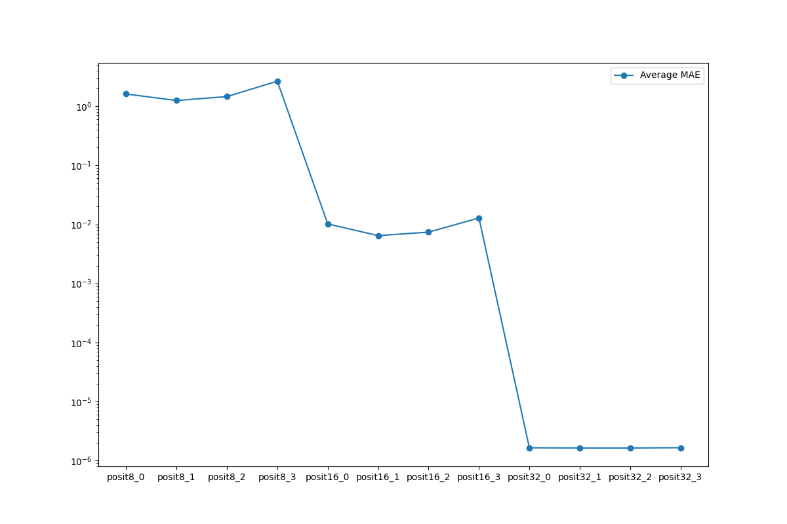
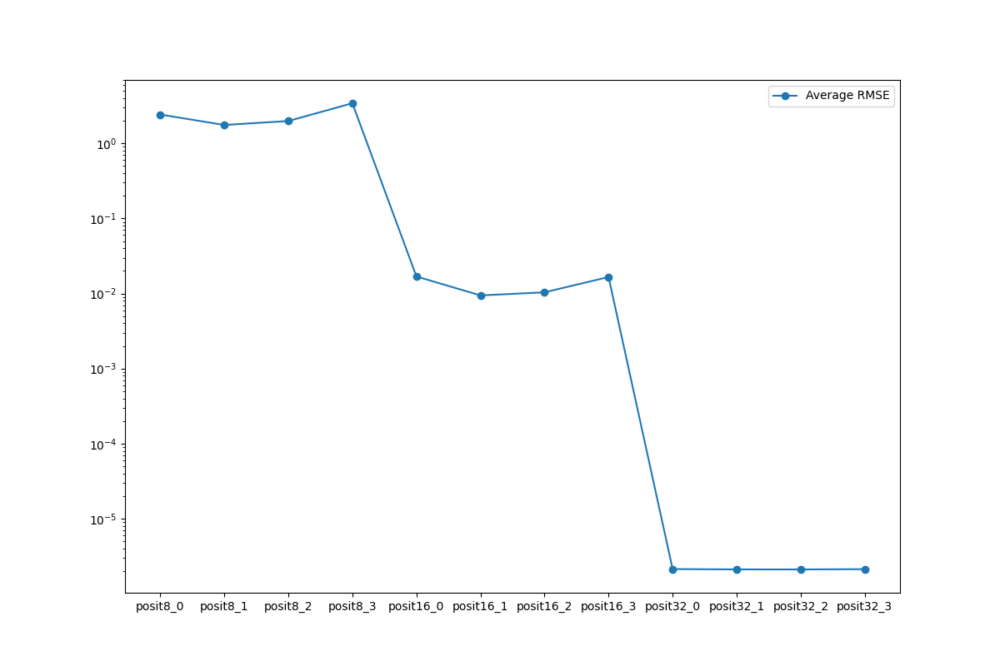

# 4-10 Personal Research
## Presenter: Yu-Chun Hung
## Advisor: Peng-Sheng Cheng

---

# Summary

- Fixed the Posit NaR issue, at least for MNIST model.
	- Fixed by replace the hardcoded posit constant conversion in pass.

---

# Bug fix approach

- Add the CCU posit library as 3rd party dependency.
- Link the posit library with CMake. (Which is excruciating to integrate)
- Use the `getRawBit()` template function that was used for python wrapper.
- Integrate with `APFloat::convertToDouble()`.

---

# MNIST Average Top-1-Accuracy (N = 250)

---

# MNIST Average Top-5-Accuracy (N = 250)

---

# MNIST Average MAE (N = 250)

---

# MNIST Average RMSE (N = 250)

---

# Future Works

- Finish object detection experiment.
- Full Statistics for classification experiments so far.
- Next week lab meeting group report

---

# Thank you!