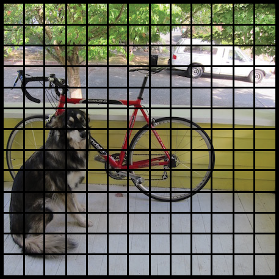
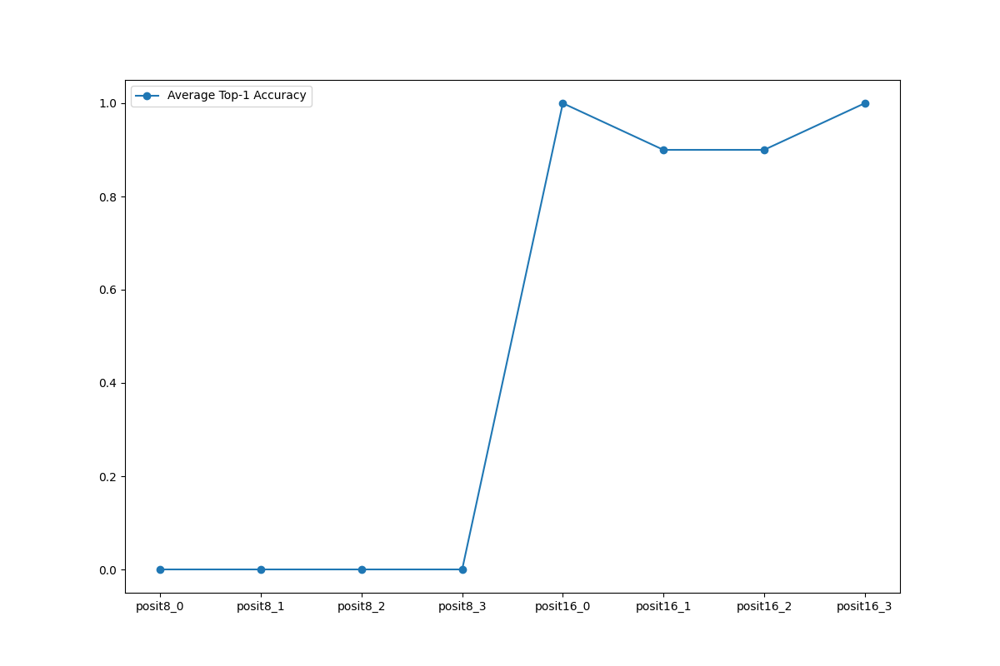
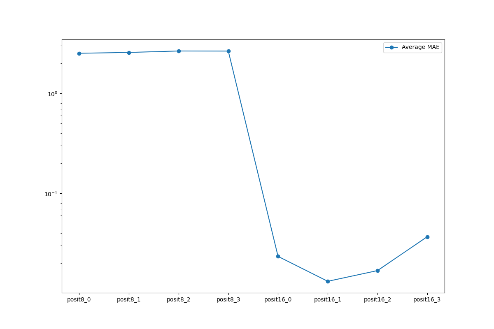

# 4-24 Personal Research
## Presenter: Yu-Chun Hung
## Advisor: Peng-Sheng Cheng

---

# Summary

- Focus on object detection part
	- Only yolov2-tiny can run.
	- The post process part is excruciate to write
- We should make the sample higher on image classification (currently 10 sample)

---

# How to get result from tiny yolo v2?

---

# How to get result from tiny yolo v2?

1. output tensor is (1, 125, 13, 13), input image is (1, 3, 416, 416)
2. output (13, 13) -> 32\*32 pixel grid, we have 13\*13 
3. output 125 -> (x, y, w, h, confidence on grid) + (20 classification possibility) \* (5 anchors)
4. Use NMS to remove overlap detection.
5. mAP benchmark on object detection
   
Currently we are on step 3, the yolo experiment is still running.

---
# Mistake in yolov2-tiny

- v7 opset in onnx/models does not work, use v8 instead
- Do not normalize pixel value (0, 255) -> (0, 1)
- Don't use ChatGPT, use the existing solution on github instead.
- Use ONNX runtime to verify your model and postprocess is working or not first.

---

# Image classification: MobileNet accuracy

---

# Image classification: Resnet18 accuracy

---
# Image classification: MobileNet Average MAE

---

# Image classification: Resnet18 Average MAE

---

# Image classification:

- Current Sample is 10, we should make it higher,
- Posit 8 all failed, Posit(16, 1) seems the best configuration of all.

---

# Future work

- Finish tinyyolov2 benchmark
- Writing master thesis.