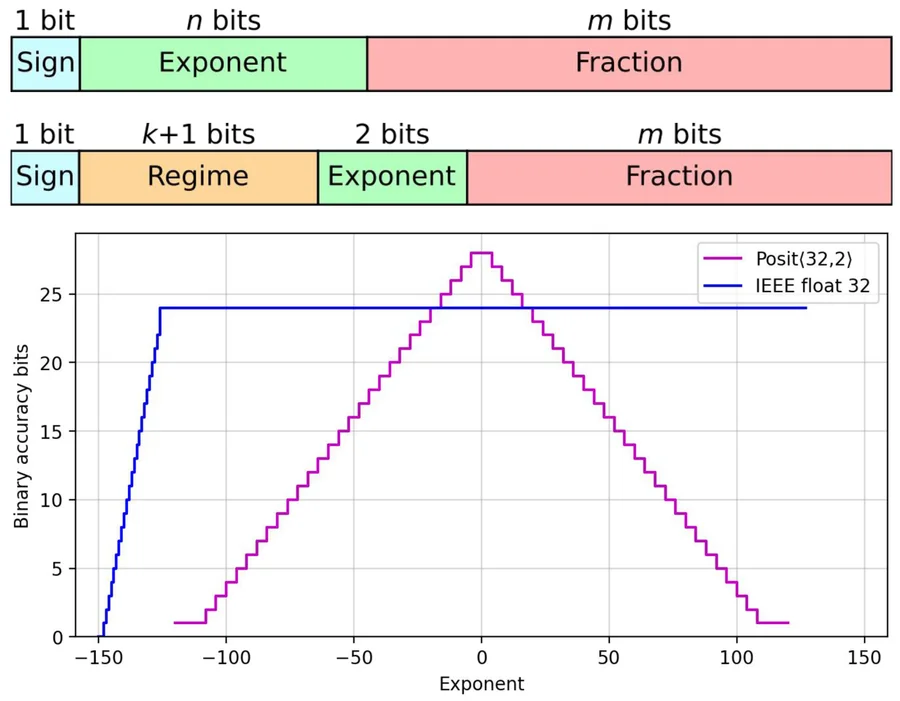

# ONNX Model Inference Using Quantized Posit Format in MLIR Framework

## What is Posit Arithmetic?

- A **floating-point alternative** proposed by John L. Gustafson in 2017.
- Designed to **improve precision, dynamic range, and efficiency** over IEEE 754 floating-point.
## Features

- **Tapered precision**: Higher precision near exponent values close to 0.
- **Wider dynamic range** than same-bit-width IEEE floats.
- **No special cases** like NaN, ±Inf (except a single NaR: “Not a Real”).

cite : https://spectrum.ieee.org/floating-point-numbers-posits-processor

---

## Posit Arithmetic Format, with posit(8, 2) as example:

- **Total bits (n)**: 8
- **Exponent size (es)**: 2 bits
- $useed  = 2^{2^{es}} = 2^{4} = 16$
#### Sign Bit
- `0` means positive, `1` means negative
- Negative in this case
#### Regime Bit
- Encoded in unary: a run of 0s or 1s followed by the opposite bit
- Encodes a scale factor exponent `k`
	- 10 -> k = 0, 110 -> k = 1, so on
	- 01 -> k = -1, 001 -> k = -2
- Overall scaling factor is $\text{useed}^k$, where it is $16^{1} = 16$
#### Exponent
- `es` bits after regime
- Refines the scale factor with an additional multiplier
#### Fraction (Significand
- Remaining bits
- Represents precision as a binary fraction with implicit leading 1
- Interpreted as $1 + f_0 + f_1 + {...}$

## Final Value:

$$
\begin{align}
\text{Posit value} = (-1)^s \times \text{useed}^k \times 2^{\text{exponent}} \times \text{significand}
\\ = (-1)^1 \times 16^1 \times 2^3 \times 1.25 \\ = -1 \times 16 \times 8 \times 1.25 \\ = -160.0
\end{align}
$$

---

## What is ONNX (Open Neural Network Exchange)

- ONNX is an open format for representing machine learning models.
- Developed by **Microsoft and Facebook**
- Enabling **interoperability** across different deep learning frameworks like PyTorch, TensorFlow.

---
## What is MLIR

- **MLIR (Multi-Level Intermediate Representation)** is a compiler infrastructure project under the LLVM umbrella.
- It enables defining and transforming programs at **multiple abstraction levels**, from tensor algebra down to machine code.
## Features:

- **Extensibility and Reusablilty**: Dialects allow us to **represent, optimize, and transform** programs across different layers of abstraction
- **Framework Integration**: Backbone of modern compilers like TensorFlow XLA, Torch-MLIR, IREE.

---

## ONNX-MLIR

- onnx-mlir is an open source project initially developed by IBM Research that brings ONNX format to MLIR eco-system.

## Features:

- **ONNX Dialect**: Provides a representation of ONNX models within the MLIR framework.
- **Hardware Flexibility**: Supports deployment on diverse architectures, including CPUs, and [IBM's Telum integrated AI accelerator](https://github.com/onnx/onnx-mlir/blob/main/docs/SupportedONNXOps-NNPA.md).
- **Modular Design**: Leverages MLIR's extensible infrastructure for tailored optimization pipelines, support ONNX to other dialect transformation like TOSA and Stablehlo.
- **Interoperability**: ONNX ensures compatibility of deep learning frameworks like PyTorch and TensorFlow.
- Runtime support: Support C++ and Python runtime.

---
## Motivation:

- Quantize model is good for model efficiency, we can sacrifice little accuracy for faster inference and reduced model size.
- Posit have better precision compares with equivalent IEEE floating point. Expecting better prediction with low-bit quantization.
- ONNX for cross framework interop for model representation.
- MLIR for temporary software simulation experiment and future posit arithmetic hardware.
- We hope by mixing ONNX and MLIR technology, we can have a flexible compatible and efficient quantization solution once we have posit hardware.

---

## Overview of the project

- onnx-mlir compiler: Compiles .onnx model to fp32 and posit format to library.
- runtime: Execute model

---
## Approach

1. Getting an ONNX model, which most deep learning framework like PyTorch or TensorFlow would support.
2. Feed ONNX model to our onnx-mlir compiler.
3. Parse ONNX model and make into ONNX dialect, represent ONNX in MLIR language.
4. ONNX dialect to Krnl dialect to decompose the operator like Conv to loop representation.
5. Krnl dialect to Affine dialect for existing optimization.
6. Before lower to LLVM dialect, we mapped all our operation and data type:
	- Operation: Mapping Math/Arith operation to function call.
	- Data type: Mapping FP32 to UINT8, 16, 32, including all the dialect operation that touch FP32.
7. LLVM dialect to shared object library.
8. Link shared object library to our Posit Numerical Library.
9. With provided runtime support and compiled library, user write driver code to handle input, data preprocess, output, and etc. 
10. Acquire output from runtime.
---

## Experiment

We run our experiment with Python runtime and bash script.
- Compile: 
	- Compiles ONNX model to FP32 and various configuration of Posit format.
- Run: 
	1. Sample data from dataset.
	2. Apply model specific preprocess.
	3. Convert FP32 to Posit format.
	4. Run inference of FP32 and Posit format.
	5. Convert back from Posit to FP32.
	6. Post process the output tensor.
	7. Save output tensor as protobuf file for later analysis.
- Numerical analysis:
	- Numerical Error:
	- Model specific benchmarks

---

## Future works