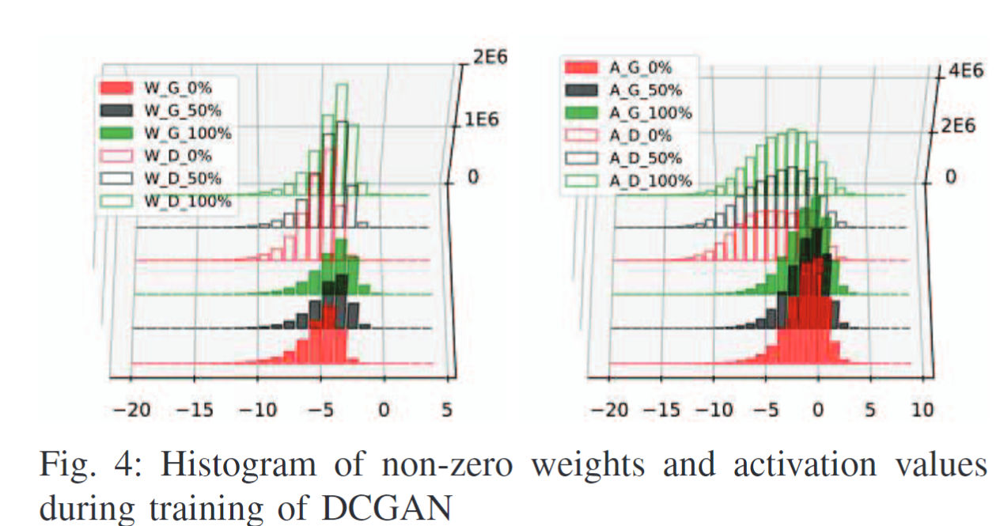
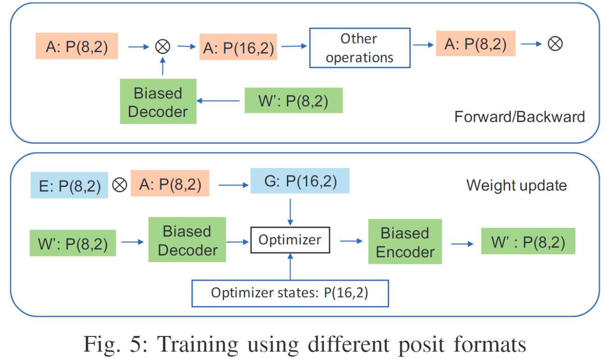

# Posit Arithmetic for the Training and Deployment of Generative Adversarial Networks

- Author: Nhut-Minh Ho, Duy-Thanh Nguyen, Himeshi De Silva, John L. Gustafson, Weng-Fai Wong, Ik Joon Chang,  National University of Singapore Kyung Hee University
- Professor: Peng-Shen, Chen
- Reporter: Yu-Chun, Hung

---

## What is GAN?

- Consists of Generator and Discriminator Network:
	- Generator (G): Create fake data.
	- Discriminator (D): Distinguish real and fake data.
- Training:
	- Train G and D at the same time
		- G try to generate fake data such that D cannot distinguish
		- D try to get better at judging real and fake data.

---
## What is GAN?

- Application:
	- Image generation
	- Data augmentation
	- Style Transfer

---

## Contribution:

- The first to use non-standard 8-bit FP format to train and 6-bit FP format to inference.
- Fast approximation of `tanh(x)` function in posit.
- Software and Hardware Evaluation of GAN in posit and other FP format.

---

## Why GAN is hard to train? 

No easy way to adopt small bit to train GAN.
- Output of GAN is millions of pixels which sensitive to numeric errors.
- At that time, the only method was to use Nvidia mixed-precision framework to train GAN.
	- Nvidia O1 mode: Only use FP16 for GEMM operator

---
## Numerical Properties of GAN training
- The height is frequency of log2(|values|)
- W -> weight, A -> Activation, G -> Generator, D -> Discriminator
- 0%, 50%, 100% means training epoch progress.
- Weights are concentrated in 2^-4 to 2^-5, need to handle
- Activations are concentrated in 2^-2 to 2^0, no need to handle

---

## Proposed Method: System architecture

- Biased Encoder/Decoder:
	- For adding/subtracting exponent bit in posit data.
		- Irrelevant to model architecture!
	- t: Exponent bias.
	- Encoder: {S, R, E + t, F} -> {P}
	- Decoder: {P, t} -> {S, R, E - t, F}
	- Are used when operation involve weight scaling

---

## Proposed Method: System architecture

- Architecture:
  - W: weights
  - A: activations
  - G: dot product of E and A
  - E: error
- dot product between `W * A` and `E * A`

---

## Proposed Method: System architecture

---

## Proposed Method: System architecture

- What is the training steps?
  - Forward Pass:
    - From input to last layer.
  - Backward Pass:
    - Calculate the error from predict output and target.
    - Gradient are computed for each weight, for steepest direction in loss function
  - Weight Update:
    - The optimizer use gradient and learning rate to control the update step.

---

## Proposed Method: Parameter Scaling

---

## Proposed Method: Loss Scaling

---

## Proposed Method: Fast Approx. of tanh(x)

---

---
