# Posit Arithmetic for the Training and Deployment of Generative Adversarial Networks

- Professor: Peng-Shen, Chen
- Reporter: Yu-Chun, Hung
- Author: Nhut-Minh Ho, Duy-Thanh Nguyen, Himeshi De Silva, John L. Gustafson, Weng-Fai Wong, Ik Joon Chang,  National University of Singapore Kyung Hee University
- Publish: IEEE Design, Automation and Test in Europe Conference 2021

---
## Insight:

- This paper is trying to train and infer GAN model with lower bit data.
- Small numerical error can cause GAN training failure.
- Posit floating point data have more precision then normal floating data when value exponent close to zero.
- Scale the weight and loss to where posit good at to exploit the bit width.

---
## What is GAN?

- Consists of Generator and Discriminator Network:
	- Generator (G): Create fake data.
	- Discriminator (D): Distinguish real and fake data.
- Training:
	- Train G and D at the same time
		- G try to generate fake data such that D cannot distinguish.
		- D try to get better at judging real and fake data.

---
## What is GAN?

- Application:
	- Image generation
	- Data augmentation
	- Style Transfer
- [Data augmentation ref](https://medium.com/abacus-ai/gans-for-data-augmentation-21a69de6c60b)
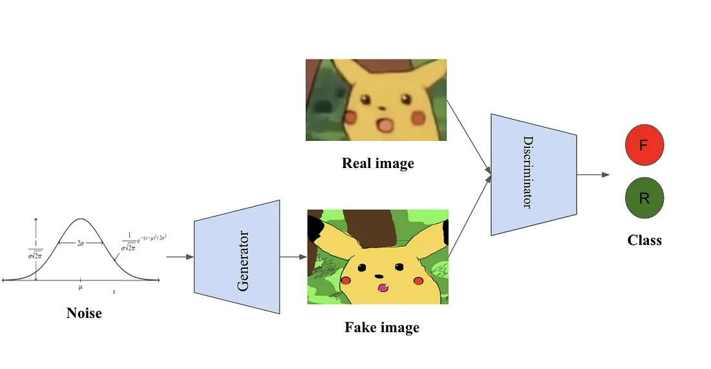

---
## What is Posit?

- Environment variables:
	- $\text{n-bit}$: length of bits, $es=3$: max length of exponent.
	- $es$ would decide $\text{useed} = 2^{2^{es}}$
	- e.g. $\text{posit<16, 3>}$
- Format:
	- sign: 0 is $+$, 1 is $-$
	- regime: 
		- resizable bit, decide the k scale.
		- duplicate leading $0/1$ and stop with opposite bit.
		- $110: k = 1$, $10: k = 0$, $01: k = -1$, $001: k = -2$
		- This term scale the value $\text{useed}^k = ({2^{2^{es}}})^k$
	- exponent: same as IEEE754 exponent, but must be positive and no bias.
	- fraction: same as IEEE754 fraction.
---
## What is Posit?

- Examples:
	- $\text{posit<16,3>}$, $es = 3$, $\text{useed} = 2^{2^{3}}$
	- sign bit 0 means it's positive  
	- regime pattern $0001 \rightarrow$  $k=-3$
		- regime term is $\text{useed}^k = ({2^{2^{3}}})^{-3} = 2^{-24} = {256}^{-3}$
	- exponent pattern $\text{binary}{(101)} = 5$, exponent term is $2^5$
	- fraction term is $1+f_1+f_2+f_3+f_4...$+ while $f_n = 2^{-n}$
	- multiply each terms to get the final value.
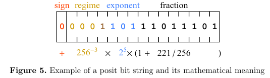
---
## What is Posit?

- Properties:
	- The carry of the posit exponent:
		- 0,001,111,0 $\rightarrow$ 
		- 0,01,000,00
		- regime bit shorter, freed one fraction bit.
	- If the full value exponent is closer to zero -> regime bit is shorter -> more space for fraction -> which means more precision.
	- Under same $es$, conversion between n-bits requires only remove/pad zeros. 

---
## Contribution:

- The first to use non-standard 8-bit FP format to train GAN and 6-bit FP format for GAN inference.
- Fast approximation of $\tanh(x)$ function in posit.
- Software and Hardware Evaluation of GAN in posit and other FP format.

---
## Why GAN is hard to train? 

- No easy way to adopt small bit to train GAN.
	- Output of GAN is millions of pixels, which sensitive to numerical errors.
	- At that time, the only reliable method to train GAN was to use Nvidia mixed-precision framework to train GAN.
		- Nvidia O1 mode: Only use FP16 for GEMM operator, and others are FP32
	- No other proposal use bit width 8 to train GAN at that time.
		- Binary training, 8-bit training do exist but not include GAN.

---

## Why GAN is hard to train? 

- My insight
	- Sensitive to hyperparameter (e.g. learning rate)
	- Mode Collapse:
		- G Generate only generate same images.
	- Diminished gradient:
		- D is too good at judging, causing G gradient vanished and learn nothing.

---
## Numerical Properties of GAN training

- The height is frequency of $\log_2(|\text{values}|)$
- W: weight, A: Activation, G: Generator, D: Discriminator
- 0%, 50%, 100% means training epoch progress.
	- Value does not change much across epoch
- Weights are concentrated in $2^{-4}$ to $2^{-5}$, need to handle
- Activations are concentrated in $2^{-2}$ to $2^{0}$, no need to handle

---

## Proposed Method: System architecture

- Biased Encoder/Decoder:
	- For add/subtract "$t$" in exponent bit in posit data.
		- This scales power of 2.
		- Irrelevant to model architecture!
	- Encoder: $\{S, R, E + t, F\} \rightarrow \{P\}$ : scaler
	- Decoder: $\{P, t\} \rightarrow \{S, R, E - t, F\}$ : de-scaler
	- The weight is stored scaled format.
		- Before compute dot product, need to decode.

---

## Proposed Method: System architecture

- Architecture:
  - W: weights, A: activation values, G: gradient, E: error
  - The dot product between $W \cdot A$ and $E \cdot A$ involves two $\text{posit<8, 2>}$ multiplication and output is $\text{posit<16,2>}$

---
## Proposed Method: System architecture

- Architecture (My insight)
	- $W \cdot A \rightarrow A$
		- $a^{(l)} = \sigma(W^{(l)} a^{(l-1)} + b^{(l)})$
			- The product of previous activation and weight plus bias is current activation value.
	- $E \cdot A \rightarrow G$
		- $\frac{\partial L}{\partial W^{(l)}} = \delta^{(l)} \cdot (a^{(l-1)})^T$
			- Gradient of loss is the product between error term and previous activation value.

---

## Proposed Method: System architecture

- For operations value change is small like "other operations" and "weight updates", stored with $\text{posit<16,2>}$ internally.
	- Standard low precision CNN training use bit width 16.
	- Especially gradient accumulator and optimizer parameters.
- The $es$ value is kept 2 in training scheme
	- Conversion between 8, 16 bit can simply add/remove 0
	- $es = 1$: fails to converge
	- $es = 3$: fraction accuracy is not enough.

---

## Proposed Method: System architecture

- The image is misleading in my opinion.
- What are the training steps?
  - Forward Pass:
    - Calculate activation value with weight, bias, previous activation value and activation value.
    - Calculate the loss with loss function metrics, which involves the difference between current and target output.
  - Backward Pass:
    - Gradient are computed for each weight, for steepest direction in loss function.
  - Weight Update:
    - The optimizer use gradient and learning rate to optimize the weight.
- Inference is just running the forward pass once.

---

## Proposed Method: Parameter Scaling

- In posit, value near exponent 0 has the most accuracy. Hence scale the value is helpful.
	- Weight scaling does not work in normal FP since the accuracy distribution is flat.
- The weight is decoded before multiply-add operation. Then encode after that.
	- Weights are kept scaled in weight update.
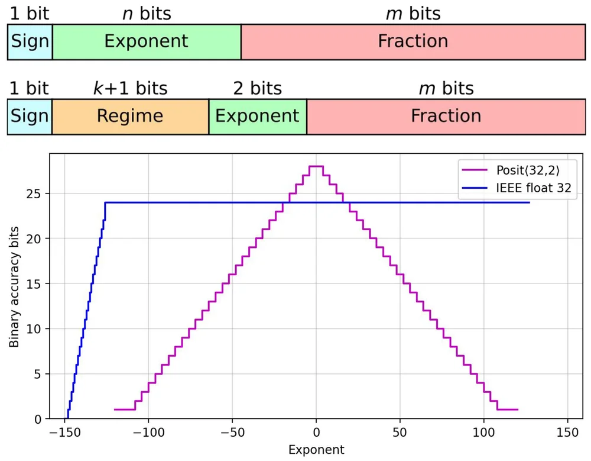
---

## Proposed Method: Parameter Scaling

- As mentioned before, t is for scaling factor in Encoder/Decoder
	- Encoder: $\{S, R, E + t, F\} \rightarrow \{P\}$
	- Decoder: $\{P, t\} \rightarrow \{S, R, E - t, F\}$
- How to decide scale t?
	- $\{ \text{bins}, \text{frequencies} \} = \text{histogram}\left( \log_2 \left( |W| \right) \right)$
	- $t = \left\lfloor 0 - \text{bins}\left[\arg\max(\text{frequencies})\right] \right\rfloor$, 
		- $t$ is integer, 
		- $\arg\max$ is the index of max array element.
	- Insight: $t$ shift the histogram such that the highest peak is 0
	

---

## Proposed Method: Parameter Scaling

- From experiment: Across different GANs, the t value is `3~5`
	- Insight: $es$ is 2, so it freed 1 to 3 bits of fraction.
- Use only the first iteration histogram to set the `t`
	- Further calibration through iteration does not payoff.
	- The value distribution does not change much during training.

---
## Proposed Method: Loss Scaling

- Loss Scaling is standard approach in low precision training.
	- Prevents small gradient values from being rounded to zero.
- Steps:
	- **During** the gradient calculation, scale by $s$.
	- After the gradient is calculated, scale the value back.
	- Use the gradient to update weight.
- Insight: Loss is a concept, since in back propagation, **loss value itself is not used**.
	- $\frac{\partial L}{\partial W^{(l)}} = \frac{\partial L}{\partial a^{(l)}} \cdot \frac{\partial a^{(l)}}{\partial z^{(l)}} \cdot \frac{\partial z^{(l)}}{\partial W^{(l)}} = \frac{\partial L}{\partial a^{(l)}} \cdot \sigma'(z^{(l)}) \cdot (a^{(l-1)})^T$
	- Let's say loss is MSE: $\frac{\partial L}{\partial a^{(l)}} = a^{(l)} - y$
- Conventional method: (float)
	- Increase $s$ until its overflow, then decrease - Nvidia Apex
- Proposed method: (posit)
	- Same as parameter scaling.

---
## Proposed Method: Loss Scaling
- X-axis: gradient value
- Y-axis: frequency
- Float loss scaling approach to overflow.

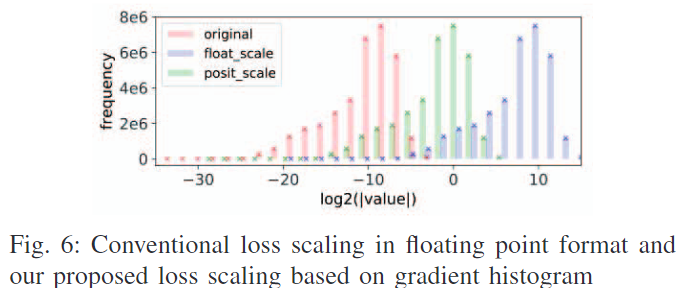

--- 
## Proposed Method: Fast Approx. of tanh(x)
- Most GANs use tanh as the output layer in the Generator
- Approximation: 
	- $\text{Sigmoid}(x) = \left( x \oplus 8000_{16} \right) \gg 2$
		- A bit operation trick in original posit paper with $es = 0$
	- $\text{PositTanh}(x) = 2 \cdot \text{Sigmoid}(2x) - 1$
	- $x$ is $\text{posit<16,0>}$, converted from the previous $\text{posit<16, 2>}$ output.
- Correction: Set threshold and bias, and add up the quantity with bounding.
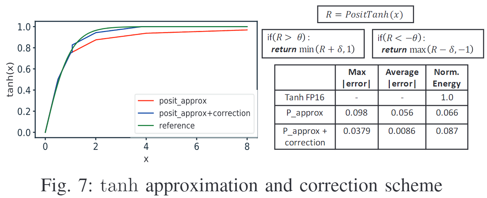
---
## Experiment

- FP32 accumulator for `mult-add` operation is enough for training.
	- FP64 is tried and does not help much, quire is not needed.
		- quire: a data type to accumulate exact sum of product without rounding.
	- The output is then quantize to P16
- Compare: (specific spec needed)
	- Nvidia Apex O1: FP16
	- QPytorch: FP8
	- This Paper: P8

---
## Experiment

- Training quality:
	- The configuration is the same for different format.
		- random number generator state, default optimizer hyper parameters, and the number of epochs set by the original work
	- GAN train with different format would give different output.
		- Zebra stripe are different on the top row.
		- Same input vector in latent space give different output at the bottom row.
		- Need metrics to judge good or bad.
		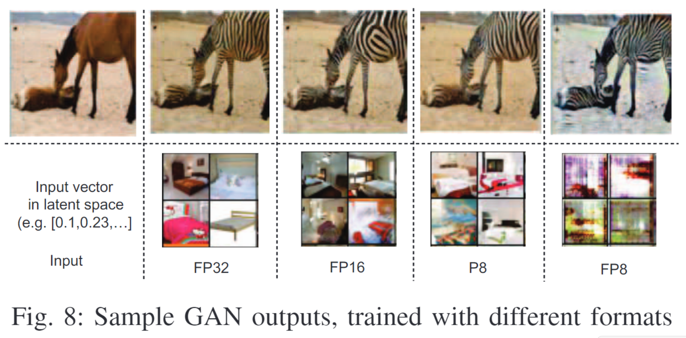
---
## Experiment

- Training quality:
	- Metrics:
		- `Frechet Inception Distance`: lower the better
		- `PSNR`: the higher the better (only in ESRGAN)
	- Result:
		- P8 outperform FP8
		- P8+ (with scaling) match fp16 training
		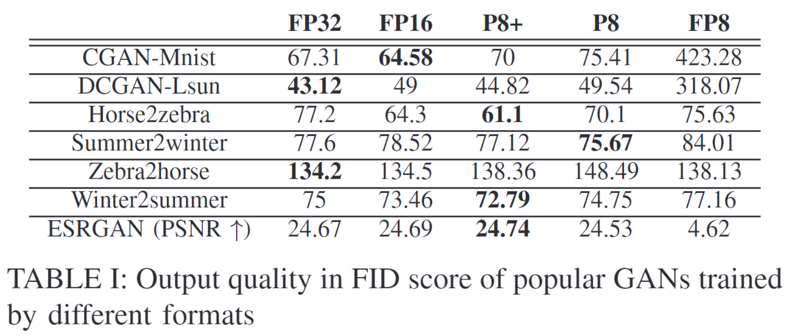

---
## Experiment:

- Post-training deployment output quality
	- Use FP32 as baseline to compare.
	- P8, P6 use $es = 1$ for best quality
	- Metrics:
		- PSNR (Peak Signal-to-Noise Ratio): Higher the better
		- SSIM (Structural Similarity Index Measure): Higher the better

---
## Experiment:

- Post-training deployment output quality
	- Compare:
		- `+` means scaling
		- `T` means `tanh` approximation
	- Result:
		- `P6+T`, `P6+` have `SSIM` > `0.9`
			- High output quality
	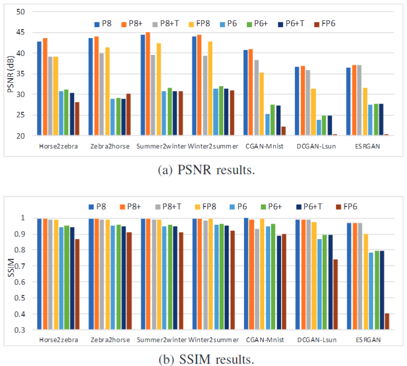

---
## Hardware Simulation

- Setup:
	- Using integrated power estimation in Synopsys’ design compiler with LP65nm CMOS standard cells
	- GEM5 simulator with MLPACK to implement DCGAN.
- Result:
	- The posit format consumes less energy and less computing time than the float format of the same size.
	- In terms of power, it scale between linearly and quadratically. (bound by matrix multiplication)
		- Division operation is bottleneck.
			- Tanh in the generator
			- Discriminator. (scale better in deployment)

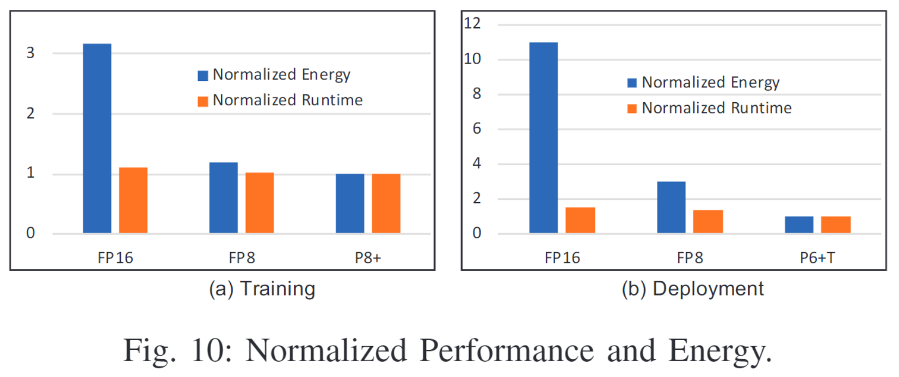

---
## Conclusion

- Presents ways to train GAN in 8-bit and deploy in 6-bit
- Using modified `PyTorch` allows to experiment with different training schemes.
- Hardware simulation shows posit has better energy and runtime.
- Once low precision accelerator emerged, the proposed method should be promising.

---
## Main Takeaway:

- In terms of scaling in posit training and inferencing:
	- Weight value is small but change of value in multiplication is big
		- Have ways to exploit.
	- Calculate gradient and weight update have high precision need.
		- Since the change of value is small, less chance to exploit precision.
- If we only focus on the inference now:
	- Just need to refer to the forward pass part in training.
	- Focus mostly on the weight scale and the operation can be applied.
		- Like multiplication.

---
## Main Takeaway:

- Take a moment on what $es$ value relate to precision: [ref](https://link.springer.com/chapter/10.1007/978-3-031-32180-1_9)
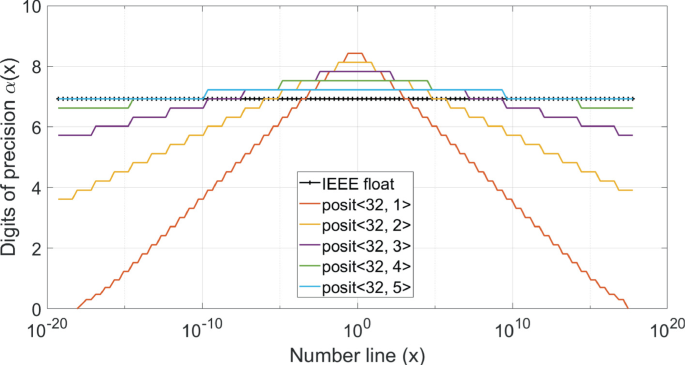
---
## Sharing:
### [塔羅牌占卜](https://www.taroscope.ai)

- [問題: 實驗室的同伴未來能不能得到幸福?](https://www.taroscope.ai/basic?answer=67210c0e8e99aa2b7844e20a)
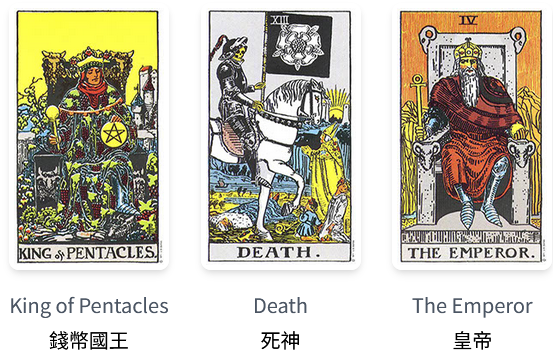

---
## Sharing

分析:
## 實驗室夥伴的幸福之路：一段關於穩固、轉變與掌控的旅程

關於你實驗室同伴的幸福，牌面呈現出一段精彩的故事，充滿了穩固的過去、必要的轉變以及充滿希望的未來。

過去的錢幣國王，顯示著他們擁有紮實的基礎，或許是穩定的經濟狀況、可靠的人際關係，或是對生活的務實態度。這份穩固為他們未來的旅程奠定了堅實的基石。

然而，現在的死神牌並非厄運的預兆，而是深刻的轉變。這張牌象徵著必要的結束，才能迎接新的開始。這可能是工作上的調整、關係的改變，亦或是內在價值觀的重新評估。這個過程或許伴隨著不安，但它是通往幸福的必經之路，如同破繭而出的蝴蝶，需要掙脫束縛才能展翅高飛。

---
## Sharing

分析:
## 實驗室夥伴的幸福之路：一段關於穩固、轉變與掌控的旅程

展望未來，皇帝牌的出現則帶來令人振奮的訊息。它代表著掌控、責任感和成熟的穩定。經歷了轉變的洗禮後，你的同伴將更能掌握自己的人生，展現出領導力和決斷力，並在生活的各個面向建立起穩固的秩序。 這並不意味著一帆風順，而是指他們將更有能力面對挑戰，並最終創造屬於他們的幸福。總之，這是一個關於成長與蛻變的故事，最終指向成熟與幸福的可能性。 他們的未來充滿希望，只要他們能勇敢地面對轉變。